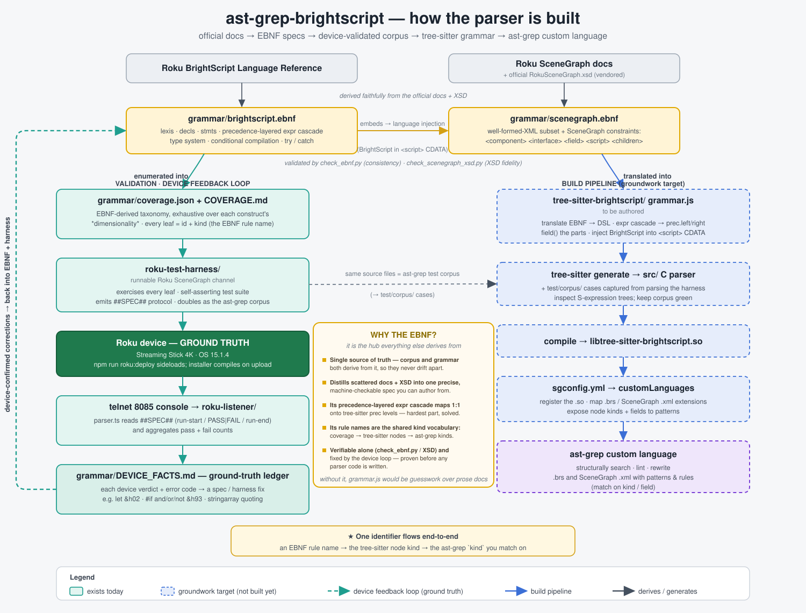

# ast-grep-brightscript

A full [ast-grep](https://ast-grep.github.io/) parser for **Roku BrightScript** and **SceneGraph** —
so you can structurally search, lint, and rewrite `.brs` and SceneGraph `.xml` files with ast-grep
patterns and rules. BrightScript is injected into SceneGraph `<script>` bodies, so BrightScript rules
also match inside `.xml`.

> **Status: parser built.** Both tree-sitter grammars are authored from the EBNF, compiled, validated
> against a device-corrected harness, and registered as ast-grep custom languages. This README is the
> **operator's runbook** — how to *run the processes* in this repo (change the language, update the
> harness, rebuild the grammar, bump the toolchain, validate). For the conceptual orientation read
> [`CLAUDE.md`](./CLAUDE.md); for the build *methodology* read the
> [skill](./.claude/skills/ast-grep-custom-language/SKILL.md).

## This is an AI-first repo

The intended operator is a coding agent (Claude Code), and the repo is laid out to be driven that way:

- **Orientation lives in `CLAUDE.md` files**, one per major directory — read the nearest one before
  working in a subtree. They are the always-loaded context layer; keep them current as you change things.
- **The build method is a skill.** [`.claude/skills/ast-grep-custom-language/SKILL.md`](./.claude/skills/ast-grep-custom-language/SKILL.md)
  is the full tree-sitter→ast-grep methodology and **auto-triggers** when you touch a `grammar.js` or
  `sgconfig.yml`. Don't reinvent the workflow — follow the skill.
- **The device is ground truth, captured in ledgers.** Whatever a real Roku accepts/rejects is
  authoritative and recorded in [`grammar/DEVICE_FACTS.md`](./grammar/DEVICE_FACTS.md); where the
  `bsc` compiler disagrees with the device, the drift is logged in
  [`grammar/BSC_DRIFT.md`](./grammar/BSC_DRIFT.md) (device always wins).
- **Everything is gated.** Five Python validators + `bsc` keep the EBNF spec, the coverage taxonomy,
  the XSD, the generated grammar, and the harness in lockstep. Keep them green (see
  [Validate everything](#validate-everything)).

## One-time setup

| Tool | Version pinned here | Used for |
|------|--------------------|----------|
| Node.js | any LTS | runs `grammar.js` via the tree-sitter CLI |
| C compiler (gcc/clang) | system | compiles the generated parser to `.so` |
| `tree-sitter-cli` | **0.26.9** | generate + build the grammars (emits **ABI 15**) |
| `@ast-grep/cli` | **0.42.3** | loads the `.so` and runs patterns/rules |
| `bun` | 1.x | runs the deploy script + the `roku-listener` |
| `python3` | 3.x | the five validation gates |

```sh
npm install                       # installs the pinned tree-sitter-cli + ast-grep + bsc (devDeps)
bun install --cwd roku-listener   # only if you'll run the device listener
cp .env.example .env              # then fill ROKU_HOST / ROKU_DEV_USER / ROKU_DEV_PASS for device work
```

> The pinned `tree-sitter-cli` ⇄ ast-grep pair is **load-bearing**: an ABI mismatch is the classic
> failure (`Incompatible language version …`). Use the versions above; if you bump one, see
> [Bump the toolchain](#process-d--bump-tree-sitter-or-ast-grep).

All commands below run from the **repo root** unless a `cd` is shown. `npx <tool>` uses the pinned
local version.

---

## Process A — change the BrightScript / SceneGraph language

Use this whenever you add or fix a construct. The chain is **spec → grammar → build → register →
validate**, and every link has a gate. Never skip straight to `grammar.js`; the EBNF is the contract.

1. **Edit the spec (source of truth).** Update [`grammar/brightscript.ebnf`](./grammar/brightscript.ebnf)
   or [`grammar/scenegraph.ebnf`](./grammar/scenegraph.ebnf). Preserve the "Notes for the tree-sitter
   implementer" section. See [`grammar/CLAUDE.md`](./grammar/CLAUDE.md).
   ```sh
   python3 grammar/check_ebnf.py            # gate 0: every rule defined + reachable, no dupes
   ```

2. **Record it in the coverage taxonomy.** `grammar/coverage.json` is the *single* key scheme — add a
   leaf with its dotted `id` + EBNF `kind`, marking `device_testable` true/false. (`COVERAGE.md` is the
   human view.)

3. **Translate to the grammar.** Edit `tree-sitter-brightscript/grammar.js` (or
   `tree-sitter-scenegraph/grammar.js`). Named rule → ast-grep `kind`; `field(...)` → `field:` selector.
   The EBNF precedence cascade maps onto `prec`/`prec.left`/`prec.right`. **Read the skill** for the DSL,
   conflicts, and the scanner (`tree-sitter-brightscript/src/scanner.c` gates keyword vs identifier).

4. **Regenerate, inspect, and corpus-test the slice** (in the grammar dir):
   ```sh
   cd tree-sitter-brightscript
   npx tree-sitter generate                 # grammar.js → src/parser.c + node-types.json
   npx tree-sitter parse ../path/to/sample.brs   # confirm zero ERROR/MISSING; read the real kinds
   npx tree-sitter test                     # run test/corpus/*.txt   (-u to update, deliberately)
   cd ..
   ```
   Add a corpus case under `test/corpus/` for the new construct (see the skill §7 for the format).

5. **Build the dynamic library** (the artifact ast-grep loads — `grammar.js` changes are invisible
   until you rebuild):
   ```sh
   cd tree-sitter-brightscript && npx tree-sitter generate && npx tree-sitter build --output brightscript.so && cd ..
   # SceneGraph:
   cd tree-sitter-scenegraph  && npx tree-sitter generate && npx tree-sitter build --output scenegraph.so  && cd ..
   ```
   The output names (`brightscript.so`, `scenegraph.so`) and grammar `name`s are exactly what
   [`sgconfig.yml`](./sgconfig.yml) references — keep them in sync if you rename anything.

6. **Validate the whole chain** — run [every gate](#validate-everything). The grammar↔coverage and
   EBNF↔grammar gates (`check_grammar.py`, `check_parity.py`) prove the new kind actually exists in the
   built parser and didn't drift from the spec.

7. **Confirm on a device** if the construct is `device_testable` — see
   [Process C](#process-c--validate-against-a-real-roku-ground-truth). Log the verdict in
   `DEVICE_FACTS.md`.

> SceneGraph note: BrightScript is **injected** into `<script>` bodies via `languageInjections` in
> `sgconfig.yml` (the SceneGraph grammar exposes the script text as a `BrightScriptBody` node). If you
> change how scripts are parsed, re-check that injection still matches — see `sgconfig.yml`'s comments.

## Process B — update the test harness / corpus

The [`roku-test-harness/`](./roku-test-harness/) is both the self-validating on-device test app **and**
the ast-grep corpus. Coverage parity is enforced: every `coverage.json` leaf must be exercised somewhere.

- **Device-testable leaf** → add a `t.spec("<id>", "<kind>", "<desc>")` block with real assertions in
  the matching `roku-test-harness/source/tests/test_*.brs` module (SceneGraph surface goes in
  `components/`). The harness compiles the *whole* channel on the device, so it can only hold syntax the
  device accepts.
- **Non-device leaf** (`device_testable:false`) → add a tagged file under
  `roku-test-harness/corpus/` — `negative/` for syntax the device **rejects** (parser must emit ERROR
  nodes) or `parse-only/` for valid-but-not-runtime-observable syntax. See
  [`roku-test-harness/corpus/README.md`](./roku-test-harness/corpus/README.md).

Then keep the gates green:
```sh
python3 grammar/check_coverage.py    # every leaf has a spec (device) or a tagged corpus file (non-device)
npm run check                        # bsc diagnostics over the harness sources (advisory — see BSC_DRIFT.md)
```
Full harness layout, the `##SPEC##` result protocol, and how to read results are in
[`roku-test-harness/README.md`](./roku-test-harness/README.md).

## Process C — validate against a real Roku (ground truth)

This is the feedback loop that makes the grammar trustworthy: sideload the harness, let the device
compile + run it, read the per-construct `##SPEC##` results. **Requires Developer Mode + `.env`** (see
setup; enable dev mode: `Home Home Home Up Up Right Left Right Left Right`).

```sh
npm run roku:deploy        # package harness → digest-auth sideload (compiles on upload) → ECP launch
```
A sideload **failure here is real device feedback** — a construct the device rejected — not a packaging
bug. The sub-steps exist individually: `roku:zip`, `roku:install`, `roku:launch`, `roku:delete`.

Read the machine-readable results off the debug console (telnet 8085) with the listener (parses the
`##SPEC##` stream into a JSON report + summary, exits non-zero on any failure):
```sh
bun run --cwd roku-listener listen                 # live device
bun run --cwd roku-listener replay <logfile>       # captured log, no device needed
bun test --cwd roku-listener                       # the listener's own unit tests
```
Record every confirmed fact in [`grammar/DEVICE_FACTS.md`](./grammar/DEVICE_FACTS.md); log any
`bsc`-vs-device divergence in [`grammar/BSC_DRIFT.md`](./grammar/BSC_DRIFT.md). Protocol details:
[`roku-listener/README.md`](./roku-listener/README.md). The debug console allows **one** connection at
a time — disconnect stray `telnet 8085` sessions first.

## Process D — bump tree-sitter or ast-grep

ABI compatibility between the two is the thing to protect. To change a version:

1. Edit the pin in `package.json` (root: `@ast-grep/cli`, `tree-sitter-cli`; the grammar
   `package.json`s also list `tree-sitter-cli`/`tree-sitter`). Run `npm install`.
2. **Regenerate + rebuild both grammars** so the `.so` ABI matches the new ast-grep
   (re-run [Process A step 5](#process-a--change-the-brightscript--scenegraph-language)). The CLI emits
   the latest ABI by default; pin an older one with `npx tree-sitter generate --abi <N>` only if ast-grep
   can't load the newest.
3. Re-run the grammar gates + an ast-grep smoke scan ([below](#process-e--write--run-ast-grep-rules)).
   The current known-good pair is **tree-sitter-cli 0.26.9 / ast-grep 0.42.3 / ABI 15**.

Symptom of a mismatch: `Incompatible language version … Compatible range: X - X. Got: Y` from ast-grep.
Fix = regenerate/rebuild with a single, current `tree-sitter-cli`; ensure ast-grep is recent enough.
See the skill §10 (Common pitfalls).

## Process E — write & run ast-grep rules

Lint/rewrite rules live in [`rules/`](./rules/) (wired via `ruleDirs` in `sgconfig.yml`; currently
empty). A rule's `language:` must be a registered name (`brightscript` / `scenegraph`).

```sh
# scan with an inline rule (matches by kind — kinds come from node-types.json / `tree-sitter parse`)
npx ast-grep scan --inline-rules 'id: find-idents
language: brightscript
rule: {kind: Identifier}' roku-test-harness/source/main.brs

# scan a saved ruleset
npx ast-grep scan -c sgconfig.yml roku-test-harness/

# inspect how ast-grep parses a pattern (essential when a pattern matches nothing)
npx ast-grep --debug-query=ast -p '<pattern>' -l brightscript
```
> Prefer `kind:`/`field:` rules read off `node-types.json` (or `tree-sitter parse`) over bare patterns:
> ast-grep's `$VAR` metavariables collide with BrightScript's `$` string sigil. `expandoChar` in
> `sgconfig.yml` can remap the metavariable char if you need pattern metavars — see the skill §8.

## Validate everything

The full gate set — run from the repo root, keep all green before committing a language change. Details
and the per-gate semantics are in [`grammar/CLAUDE.md`](./grammar/CLAUDE.md).

```sh
python3 grammar/check_ebnf.py            # 0  EBNF internal consistency (defined + reachable)
python3 grammar/check_coverage.py        # 1  coverage.json leaves ⇄ harness specs / tagged corpus
python3 grammar/check_scenegraph_xsd.py  # 2  scenegraph.ebnf enums ⇄ vendored RokuSceneGraph.xsd
python3 grammar/check_grammar.py         # 3  every coverage kind exists in the generated grammar + snippets parse
python3 grammar/check_parity.py          # 5  EBNF rule names ⇄ node-types.json kinds (no silent drift)
npm run check                            # 4  bsc over the harness (ADVISORY only — cross-check BSC_DRIFT.md)
```
Gates 0–3 and 5 are authoritative and currently green. Gate 4 (`bsc`) is advisory — it both over- and
under-rejects vs the device, so a red `bsc` line is checked against `BSC_DRIFT.md`, not obeyed blindly.

## Command reference

| Command | What it does |
|---------|--------------|
| `npm install` | install pinned tree-sitter-cli + ast-grep + bsc |
| `npm run check` / `lint` / `watch` | `bsc` diagnostics over the harness (advisory) |
| `npm run roku:deploy` | package → sideload → launch the harness on a device |
| `npm run roku:{zip,install,launch,delete}` | the deploy sub-steps |
| `npx tree-sitter generate` *(in a grammar dir)* | `grammar.js` → `src/parser.c` + `node-types.json` |
| `npx tree-sitter build --output <name>.so` | compile the parser to the `.so` ast-grep loads |
| `npx tree-sitter parse <file>` / `test` | inspect the CST / run `test/corpus/*.txt` |
| `npx ast-grep scan -c sgconfig.yml <path>` | run the registered rules |
| `npx ast-grep --debug-query=ast -p '<p>' -l <lang>` | see how a pattern parses |
| `bun run --cwd roku-listener listen` / `replay <log>` | read the device `##SPEC##` stream |
| `python3 grammar/check_*.py` | the validation gates |

## The pipeline



```
grammar/*.ebnf  ─►  tree-sitter grammar.js  ─►  C parser  ─►  .so  ─►  ast-grep customLanguage
   ▲                (BrightScript injected into SceneGraph <script> CDATA)
   └────────── device-as-ground-truth loop: sideload harness → read ##SPEC## → record facts
```

## Repo map

| Path | What it is |
|------|-----------|
| [`CLAUDE.md`](./CLAUDE.md) | top-level orientation (read first) |
| [`.claude/skills/ast-grep-custom-language/`](./.claude/skills/ast-grep-custom-language/SKILL.md) | the build methodology (auto-triggers; the "how") |
| [`grammar/`](./grammar/) | EBNF specs + coverage taxonomy + XSD + device/bsc ledgers + the five validators (the "what") |
| [`tree-sitter-brightscript/`](./tree-sitter-brightscript/) · [`tree-sitter-scenegraph/`](./tree-sitter-scenegraph/) | the built grammars (`grammar.js`, `src/`, `test/corpus/`, compiled `.so`) |
| [`sgconfig.yml`](./sgconfig.yml) | registers both grammars + injects BrightScript into SceneGraph `<script>` |
| [`rules/`](./rules/) | ast-grep lint/rewrite rules (`ruleDirs`) |
| [`roku-test-harness/`](./roku-test-harness/) | runnable Roku app: on-device spec exerciser + ast-grep corpus |
| [`roku-listener/`](./roku-listener/) | Bun/TS tool: parses the device `##SPEC##` stream → JSON report |
| [`scripts/roku-deploy.ts`](./scripts/roku-deploy.ts) | package → digest-auth sideload → ECP launch automation |
| [`roadmap/`](./roadmap/) | next-step plans (e.g. BrighterScript `.bs` support) |

## References

- Roku BrightScript Language Reference — https://developer.roku.com/dev/docs/brightscript-language-reference
- Roku SceneGraph — https://developer.roku.com/dev/docs/scenegraph
- tree-sitter — https://tree-sitter.github.io/tree-sitter/
- ast-grep custom languages — https://ast-grep.github.io/advanced/custom-language.html
